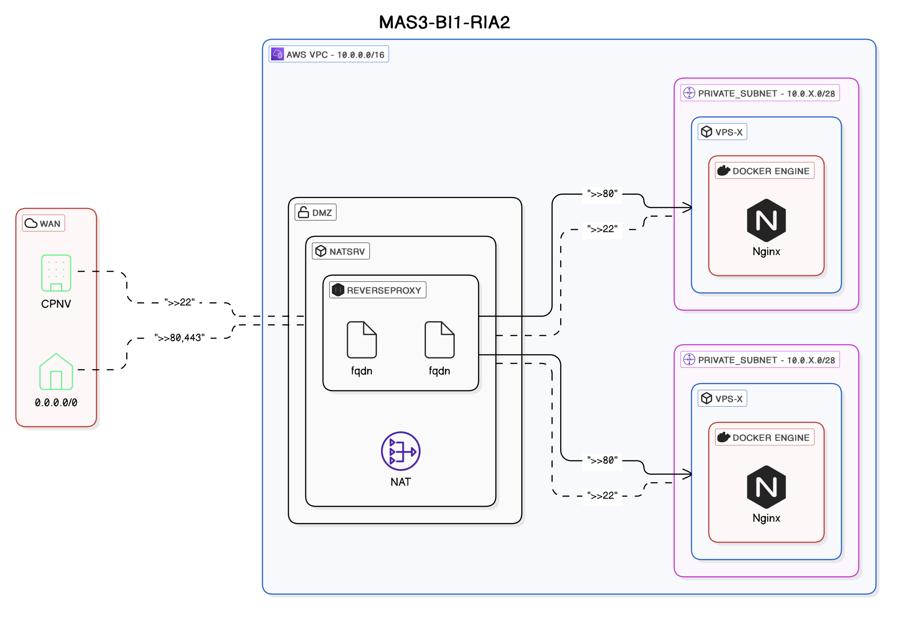

# INFRA-DEPLOY

## Infrastructure schema
Network-specific configuration (such as security group rules, route tables, etc.) is available here : [Network configuration (wiki)](https://github.com/CPNV-ES-BI1-RIA2-ETL-INTERNAL-SOURCE/INFRA-DEPLOY-ELT/wiki/Network-configuration)

# Prerequisites
- AWS permissions
	- Creating, updating and deleting Virtual Private Cloud
	- Creating, updating and deleting EC2 instances
	- Creating, updating and deleting subdomains on Route53 domain
# Usage
## Terraform
>*Version used : [v1.10.2](https://releases.hashicorp.com/terraform/1.10.2/)*

1. Configure your AWS in ~/.aws/config & ~/.aws/credentials under a profile named "RIA2"
	1. OR => Change the profile name in terraform/version.tf
2. Create your `terraform.tfvars.json` file (from the example)
3. Run the terraform
```
terraform init
terraform apply -var="environment=dev"
```
The `environment` is use to separate the env. dev, prod, and integration (for example). It will add the value to the VPC name. The default value is `dev`.
## Ansible
> Version used : [ansible core 2.14.16](https://docs.ansible.com/ansible/latest/roadmap/ROADMAP_2_14.html), [python 3.11.2](https://www.python.org/downloads/release/python-3112/) <br>
> WSL : Debian 12 (bookworm)

*As a Windows user, I'm using WSL (Debian 12) to run ansible playbook*
The default configuration is set in `./ansible/ansible.cfg` file.
### Setup
1. Put the admin. ssh key in `~/.ssh/ria2_sysadm` (or adapt in `./ansible/ansible.cfg`)
2. Install roles dependencies
	1. `ansible-galaxy install -f -r requirements.yml --roles-path=./roles`
### Setup the instances
This will automatically :
- Setup the NAT server (IPv4 forward)
- Install docker on every subnets instances
- Run a basic nginx container on the first instance of every subnets
- Create a virtual host with the subnet's FQDN created by terraform to redirect to their first host
- Setup SSL certificate with certbot

```bash
cd ./ansible
ansible-playbook -i ./cluster_hosts.ini setup.yml --user admin --private-key ~/.ssh/ria2_sysadm
```
